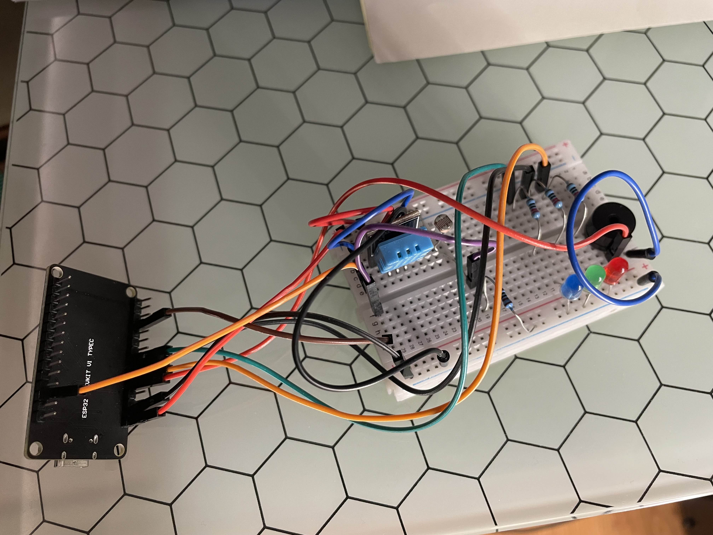
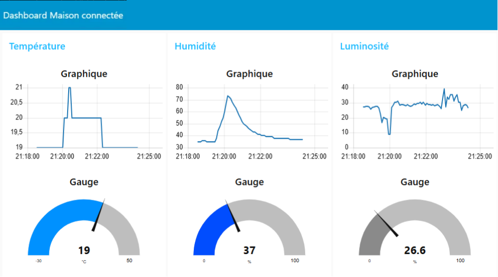

# 🌡️ Système de Surveillance de Température et Humidité pour Maison Intelligente

  

## 📌 Description  
Ce projet IoT permet de surveiller en temps réel la **température**, l'**humidité** et la **luminosité** dans un environnement domestique. Il utilise un **ESP32** pour collecter les données, un **broker MQTT** pour la communication, et **Node-RED** pour l'affichage sous forme de **dashboard interactif**.  

## 🛠️ Technologies utilisées  
- **ESP32** : Microcontrôleur pour la collecte et l'envoi des données  
- **DHT11** : Capteur de température et d'humidité  
- **LDR** : Capteur de luminosité  
- **MQTT ([MyQTTHub](https://myqtthub.com/))** : Protocole de communication  
- **Node-RED** : Interface de visualisation des données  
- **Python** : Langage de programmation de l'ESP32  

## ⚙️ Fonctionnalités  
- Surveillance en temps réel de la température, l'humidité et la luminosité
- Transmission des données via **MQTT**  
- Interface graphique **Node-RED** (Dashboard interactif et personnalisable)  
- Alertes **LEDs et buzzer** selon des seuils définis (Buzzer : (dé)connexion WIFI / LEDs dépassement de seuils)
- Connexion **WiFi** pour un suivi à distance  

## 📷 Aperçu de l'interface  

## 🚀 Utilisation  

- **ESP32** avec **MicroPython** installé ([Tuto MicroPython](https://docs.micropython.org/en/latest/esp32/tutorial/intro.html))
- **Node-RED** installé sur un PC/Raspberry Pi ([Image config Node-RED](.github/config-nodered.jpg))
- Compte **MyQTTHub** pour le broker MQTT
- Upload les fichiers `boot.py` et `main.py` avec **Thonny IDE** avec les identifiants du broker MQTT
- Branchements sur Breadboard ([Image](.github/montage.jpg))

